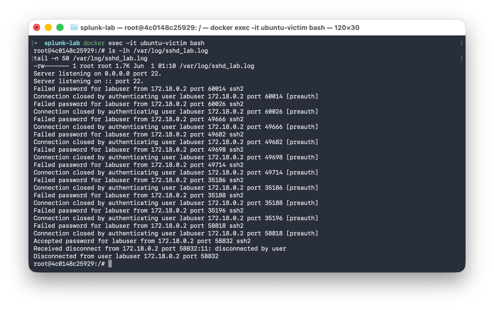
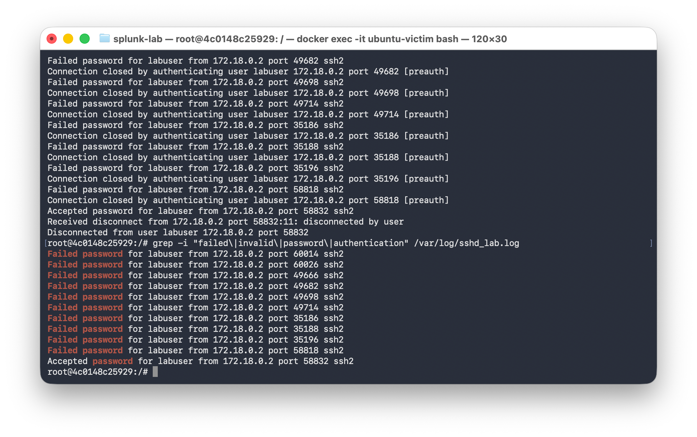
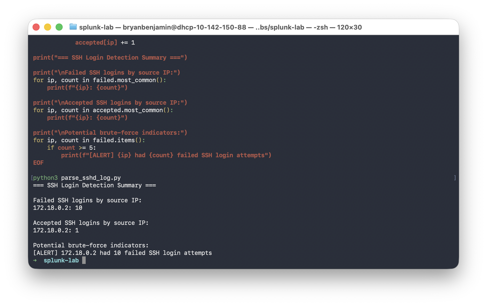

# Splunk SOC Detection and SSH Brute-Force Lab

## Overview
This project builds a small SOC-style lab using Docker containers to simulate SSH authentication activity and detect suspicious login behavior.

## Lab Environment
- Host: macOS
- Attacker: Kali Linux Docker container
- Victim: Ubuntu Docker container
- Network: isolated Docker bridge network
- Service: OpenSSH on TCP port 22

## Scenario
The Kali container attempted multiple SSH logins against the Ubuntu victim using an incorrect password, followed by one successful login.

## Detection Goal
Identify potential SSH brute-force behavior by counting failed login attempts by source IP.

## Detection Result
The source IP `172.18.0.2` generated 10 failed SSH login attempts and 1 accepted login. The Python detection script flagged this as potential brute-force activity.

## Screenshots

### Figure 1: Raw SSHD Log Events

### Figure 2: Filtered Authentication Events

### Figure 3: Python Detection Alert Output

## Skills Demonstrated
- Docker-based cyber lab setup
- SSH authentication log collection
- Python log parsing
- Brute-force detection logic
- SOC-style investigation documentation
- Splunk SPL detection preparation

## Next Steps
- Ingest `sshd_lab.log` into Splunk
- Create SPL searches for failed and successful logins
- Build a Splunk dashboard
- Add dashboard screenshots to the repository
